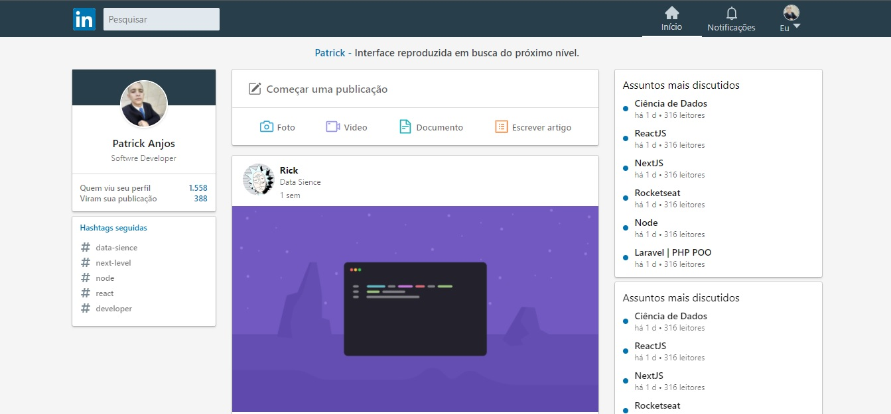

# Interface Linkedin

<div>
   
</div>

## 🌐
<a href="https://helpful-zuccutto-2dfde0.netlify.app/" target="_blank" style={{ textDecoration:underline }}>Acess Web site</a>

### 🌌 Tecnologias 🌌

- Typescript
- ReactJs

## 💾 Clone

```sh
git clone https://github.com/setxpro/Interface-Linkedin.git
```

## Author

```sh
👤 Patrick Anjos 
```
